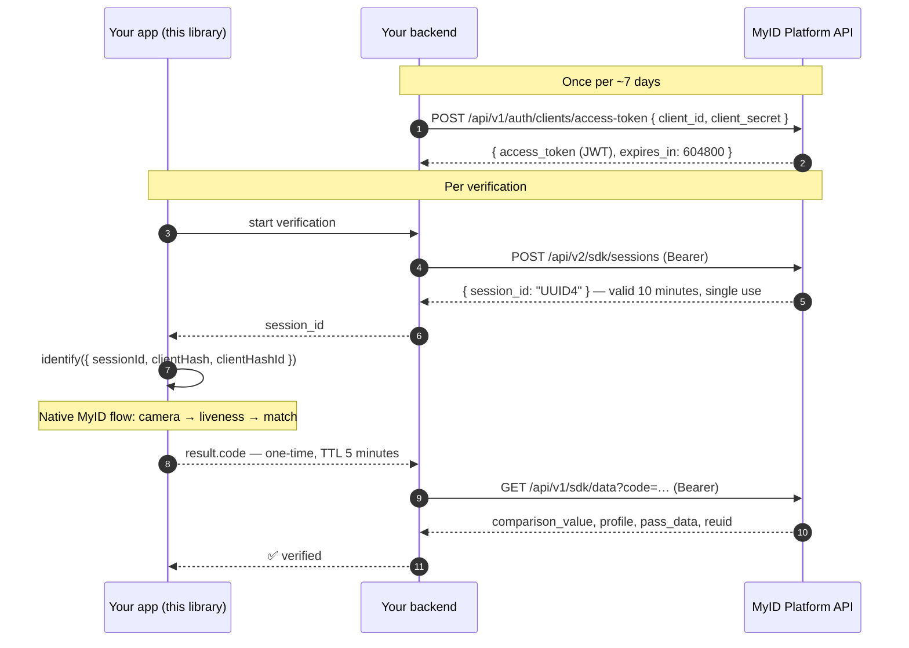

# @softwhere-uz/react-native-myid

**English** · [Русский](docs/i18n/README.ru.md) · [O'zbekcha](docs/i18n/README.uz.md)

> **MyID** biometric identification (face liveness / eKYC) for **React Native** and **Expo** — one typed API, a first-class Expo **config plugin**, New Architecture support, and current MyID 3.1.x SDKs. Verified end-to-end on real hardware.

[](https://www.npmjs.com/package/@softwhere-uz/react-native-myid)
[](https://github.com/softwhere-uz/react-native-myid/actions/workflows/ci.yml)
[-blue.svg)](./LICENSE)
[](./src/MyId.types.ts)

> [!IMPORTANT]
> **Unofficial.** This library is **not affiliated with, endorsed by, or maintained by MyID or UZINFOCOM LLC.** It is an independent, correctly-licensed wrapper: the native MyID SDKs remain commercial software of UZINFOCOM and are **referenced, never redistributed**, by this package. See [Licensing](#licensing) and [`NOTICE`](./NOTICE).
>
> **Provenance.** The React Native bridge that MyID ships in its official [`myid-rn-sdk`](https://gitlab.myid.uz/myid-public-code/myid-rn-sdk) reference repo was written by this project's author — its `ios/MyIdModule.swift` still opens with `// Created by Kamronbek Juraev on 23/07/24.` This package is the maintained, packaged, session-flow (3.1.x) evolution of that work.

---

## Contents

- [What is MyID?](#what-is-myid)
- [How a verification works end-to-end](#how-a-verification-works-end-to-end)
- [Requirements](#requirements)
- [Installation — Expo](#installation--expo-recommended)
- [Installation — bare React Native](#installation--bare-react-native)
- [Quickstart](#quickstart)
- [Your backend: minting a session](#your-backend-minting-a-session)
- [API reference](#api-reference)
- [Error handling](#error-handling)
- [Mock mode](#mock-mode)
- [Config plugin reference](#config-plugin-reference)
- [Troubleshooting](#troubleshooting)
- [Verified on real hardware](#verified-on-real-hardware)
- [Comparison with other wrappers](#comparison-with-other-wrappers)
- [Security checklist](#security-checklist)
- [Licensing](#licensing)

## What is MyID?

[MyID](https://myid.uz) is Uzbekistan's national **biometric facial identification** platform, operated by **UZINFOCOM LLC** (the state Single Integrator) — 19+ million users, 280+ million authorizations, used by commercial banks, fintech, telecom, and government services. Its Mobile SDK performs **face liveness detection** and matches the user against state records.

This package wraps the native MyID iOS and Android SDKs (the modern, **session-based 3.1.x** generation) behind a single typed React Native call:

```ts
const result = await identify({ sessionId, clientHash, clientHashId });
// result.code → send to YOUR backend → GET /api/v1/sdk/data?code=… → verified profile
```

**MyID is a gated, contract-based service.** Credentials (`clientHash`, `clientHashId`, and the backend `client_id`/`client_secret`) are provided by the MyID sales team under a commercial contract. This library cannot — and does not try to — remove that gate. What it removes is *all of the native integration friction*, on both Expo and bare React Native.

## How a verification works end-to-end

MyID 3.1.x is **session-based**: your backend mints a short-lived session, the device runs the biometric flow against it, and your backend redeems the resulting one-time code. The SDK-side legacy `clientId` + passport-data flow was removed in 3.x.



Full platform reference: [MyID docs — Mobile SDK (new flow)](https://docs.myid.uz/#/en/sdknew).

> [!NOTE]
> **"Expo support" ≠ Expo Go.** MyID ships proprietary native code, so it can never run inside Expo Go. Expo support here means **Continuous Native Generation**: the config plugin + `npx expo prebuild`, run as a development build or EAS build.

## Requirements

| You need | From | Notes |
|---|---|---|
| `clientHash`, `clientHashId` | MyID sales team | SDK-side credentials, issued under a MyID partnership contract. |
| `client_id`, `client_secret` | MyID sales team | **Backend-only** credentials for the session API. Never ship them in the app. |
| A per-verification `sessionId` | **Your backend** | A UUID4 minted from `POST /api/v2/sdk/sessions`. Single-use, 10-minute lifetime. |
| A physical device | — | Liveness needs a real camera; simulators/emulators cannot complete the flow. |

**Platform floor:** iOS 13.0+ · Android — the MyID SDK's own floor is minSdk 21; your React Native/Expo project's minimum governs in practice · React Native 0.74+ (New Architecture and legacy) · works in Expo (dev builds / EAS) and bare React Native. Pinned SDKs: iOS CocoaPods [`MyIdSDK ~> 3.1.3`](https://cocoapods.org/pods/MyIdSDK), Android `uz.myid.sdk.capture:myid-capture-sdk:3.1.9` from the official `artifactory.myid.uz` repository (release/debug variants split correctly; never resolved with `+`, so a beta can never leak into your build).

## Installation — Expo (recommended)

```sh
npx expo install @softwhere-uz/react-native-myid
```

Add the config plugin to your app config:

```jsonc
// app.json
{
  "expo": {
    "plugins": [
      [
        "@softwhere-uz/react-native-myid",
        { "cameraPermission": "We use the camera to verify your identity with MyID." }
      ]
    ]
  }
}
```

```sh
npx expo prebuild        # generates ios/ + android/ fully configured
npx expo run:ios         # a development build — not Expo Go
```

That's the whole native setup. The plugin performs every step the MyID SDKs require — including the three iOS steps most integrations get wrong:

| # | What the plugin does | Why |
|---|---|---|
| 1 | iOS: app-global **static frameworks** (`ios.useFrameworks: "static"`) | `MyIdSDK.xcframework` (Swift binary) requires static linkage. |
| 2 | iOS: `NSCameraUsageDescription` (+ optional microphone string) | Mandatory for App Store submission; face capture needs it. |
| 3 | iOS: **privacy manifest** required-reason APIs (`0A2A.1`, `35F9.1`, `85F4.1`, `CA92.1`) | Extracted verbatim from the shipped `MyIdSDK.xcframework`. Under static frameworks Apple does not reliably read the pod's own manifest — the app must declare these. |
| 4 | iOS: optional Firebase/static-frameworks `post_install` workaround | Off by default; see [plugin reference](#config-plugin-reference). |
| 5 | Android: `CAMERA` + `INTERNET` permissions | Required by the SDK. |
| 6 | Android: official MyID Maven repository in `allprojects.repositories` | Serves the `myid-capture-sdk` artifact. |

All mods are **idempotent** (safe to re-run `prebuild`) and covered by unit tests.

## Installation — bare React Native

The library is an [Expo Module](https://docs.expo.dev/modules/overview/), which works in bare React Native apps — this exact path is [verified on a real device](#verified-on-real-hardware).

```sh
npm install @softwhere-uz/react-native-myid
npx install-expo-modules@latest   # one-time: adds the Expo Modules runtime to a bare app
```

Then configure the native projects (once):

**iOS** — in `ios/Podfile`, enable app-global static frameworks, then install pods. `MyIdSDK` is pulled from CocoaPods trunk automatically by this package's podspec:

```ruby
use_frameworks! :linkage => :static
```

```sh
cd ios && pod install
```

- Add `NSCameraUsageDescription` to `Info.plist`.
- Add the four required-reason entries to `PrivacyInfo.xcprivacy` (categories `FileTimestamp` → `0A2A.1`, `SystemBootTime` → `35F9.1`, `DiskSpace` → `85F4.1`, `UserDefaults` → `CA92.1`) — or copy them from [the plugin source](./plugin/src/index.ts), which is the single source of truth.

> [!TIP]
> **Xcode 26:** if `AppDelegate.swift` fails with *"ambiguous implicit access level for import of 'Expo'"*, change line 1 to `internal import Expo`. The `install-expo-modules` codemod writes a plain `import`, which is ambiguous under Swift's access-level-imports rules with static frameworks.

**Android** — add the official MyID Maven repository to your root `build.gradle`; the SDK dependency itself is declared by this package:

```groovy
allprojects {
  repositories {
    maven { url "https://artifactory.myid.uz/artifactory/myid" }
  }
}
```

Camera and Internet permissions are declared in the library's manifest and merge automatically. Request camera permission at runtime before calling `identify()` (or let the MyID flow prompt).

## Quickstart

```tsx
import {
  identify,
  isMyIdError,
  type MyIdConfig,
  type MyIdResult,
} from '@softwhere-uz/react-native-myid';

export async function verifyUser(sessionId: string): Promise<MyIdResult | null> {
  const config: MyIdConfig = {
    sessionId,                    // UUID4 minted by YOUR backend (see next section)
    clientHash: MYID_CLIENT_HASH, // issued by the MyID sales team
    clientHashId: MYID_CLIENT_HASH_ID,
    environment: 'SANDBOX',       // 'PRODUCTION' for live contracts
    locale: 'UZ',                 // 'UZ' | 'RU' | 'EN'
  };

  try {
    const result = await identify(config);
    // result.code is a ONE-TIME code (5-minute TTL).
    // Redeem it from your backend: GET /api/v1/sdk/data?code=…
    // NEVER trust the client result alone.
    return result;
  } catch (error) {
    if (isMyIdError(error)) {
      switch (error.kind) {
        case 'cancelled':   return null;                    // user closed the flow — normal
        case 'permission':  throw new Error('Camera permission is required.');
        case 'network':     throw new Error('Connection problem — try again.');
        default:            throw new Error(`MyID failed (${error.code ?? error.kind}): ${error.message}`);
      }
    }
    throw error;
  }
}
```

A user closing the flow is a **first-class outcome** (`kind: 'cancelled'`), not a crash and not a generic error — your funnel analytics will thank you.

## Your backend: minting a session

Sessions are minted **backend-to-backend** with your MyID API credentials ([official docs](https://docs.myid.uz/#/en/sdknew)). Minimal Node/TypeScript sketch:

```ts
// 1) Access token — cache it; it lives 7 days (expires_in: 604800).
const { access_token } = await fetch(`${MYID_HOST}/api/v1/auth/clients/access-token`, {
  method: 'POST',
  headers: { 'Content-Type': 'application/json' },
  body: JSON.stringify({
    client_id: process.env.MYID_CLIENT_ID,        // backend env vars —
    client_secret: process.env.MYID_CLIENT_SECRET, // NEVER in the mobile app
  }),
}).then(r => r.json());

// 2) Session — single-use, valid 10 minutes. Empty body = the SDK shows its
//    own passport-input screen; or pre-fill with pass_data/pinfl + birth_date.
const { session_id } = await fetch(`${MYID_HOST}/api/v2/sdk/sessions`, {
  method: 'POST',
  headers: { Authorization: `Bearer ${access_token}`, 'Content-Type': 'application/json' },
  body: JSON.stringify({}),
}).then(r => r.json());
// → hand session_id (a UUID4) to the app for identify()

// 3) After the app returns result.code (one-time, 5-minute TTL):
const profile = await fetch(`${MYID_HOST}/api/v1/sdk/data?code=${code}`, {
  headers: { Authorization: `Bearer ${access_token}` },
}).then(r => r.json());
// → profile.comparison_value, profile.profile.*, profile.reuid (for the
//   Secondary Request Flow — re-verifying a known user without passport data)
```

If the app never comes back (crash, abandonment), recover server-side: `GET /api/v1/sdk/sessions/{session_id}` → `{ code, status: 'in_progress' | 'closed' | 'expired', attempts[] }`.

## API reference

### `identify(config: MyIdConfig): Promise<MyIdResult>`

Launches the native MyID flow. Resolves on success; rejects with a [`MyIdError`](#error-handling) otherwise — including user-cancel. Validates the config before crossing the bridge (bad input rejects with `kind: 'config'`, never a native crash).

### `MyIdConfig`

| Field | Type | Default | Notes |
|---|---|---|---|
| `sessionId` | `string` | **required** | UUID4 minted per-verification by your backend. Single-use. |
| `clientHash` | `string` | **required** | Issued by the MyID sales team. |
| `clientHashId` | `string` | **required** | Issued by the MyID sales team. |
| `environment` | `'SANDBOX' \| 'PRODUCTION'` | `'PRODUCTION'` | Must match the environment the session was minted in. |
| `entryType` | `'IDENTIFICATION' \| 'FACE_DETECTION' \| 'VIDEO_IDENTIFICATION'` | `'IDENTIFICATION'` | `VIDEO_IDENTIFICATION` needs the extra video SDK on Android. |
| `locale` | `'UZ' \| 'RU' \| 'EN'` | SDK default (Uzbek) | UI language of the flow. |
| `residency` | `'RESIDENT' \| 'NON_RESIDENT' \| 'USER_DEFINED'` | SDK default | Residency hint. |
| `cameraShape` | `'CIRCLE' \| 'ELLIPSE'` | SDK default | Face-capture cutout shape. |
| `cameraSelector` | `'FRONT' \| 'BACK'` | `'FRONT'` | Liveness normally uses the front camera. |
| `minAge` | `number` | SDK default (16) | Minimum age gate. |
| `distance` | `number` | SDK default | Face-distance threshold. |
| `showErrorScreen` | `boolean` | SDK default | Whether the SDK shows its own error screen before returning. |
| `organizationDetails` | `{ phoneNumber?, logo? }` | — | Branding inside the flow. |
| `appearance` | [`MyIdAppearance`](./src/MyId.types.ts) | — | Colors + button radius. iOS applies programmatically; Android theming is primarily XML-resource based, so some fields may be ignored there. |
| `huaweiAppId` | `string` | — | **Android/HMS only** — for no-Google-Play devices. Ignored on iOS. |

### `MyIdResult`

| Field | Type | Notes |
|---|---|---|
| `code` | `string` | One-time identification code (5-minute TTL). **Redeem server-side** via `GET /api/v1/sdk/data?code=…`. |
| `base64Image` | `string?` | Captured face portrait, normalized to **PNG without data-URI prefix on both platforms** (upstream references disagree: iOS emits JPEG, Android PNG — this library normalizes). |
| `comparison` | `number?` | Face-match score when the SDK provides one (absent on iOS 3.1.3). The authoritative `comparison_value` comes from the backend data endpoint. |

## Error handling

`identify()` rejects with a single, serialization-safe error type:

```ts
class MyIdError extends Error {
  kind: 'cancelled' | 'permission' | 'network' | 'sdk' | 'no_activity' | 'config' | 'unknown';
  code?: number;          // raw MyID SDK code, when present
  nativeMessage?: string; // raw SDK message, when present
}

isMyIdError(e: unknown): e is MyIdError  // robust across bridge/realm boundaries
```

| `kind` | Meaning | Typical handling |
|---|---|---|
| `cancelled` | User exited the flow. | Not an error — return to the previous screen. |
| `permission` | Camera access denied (SDK code **102**). | Prompt to enable the camera in Settings. |
| `network` | Connectivity/transport failure. | Offer retry. |
| `sdk` | The MyID SDK reported an error — inspect `code` + `nativeMessage`. | Branch on `code`; surface a friendly message. |
| `no_activity` | Android had no foreground Activity. | Retry when the app is foregrounded. |
| `config` | Invalid `MyIdConfig` (caught **before** the native call). | Fix the call site. |
| `unknown` | Anything else. | Report with `nativeMessage`. |

**MyID SDK codes** you will actually meet (from the [official table](https://docs.myid.uz/#/en/sdknew)): `101` internal SDK error · `102` camera access denied · `103` universal server/SDK error — *the official guidance is to read the message that accompanies a 103* (this library preserves it in `nativeMessage`) · `122` user banned (the SDK's `ttl` carries the ban countdown). The full backend `result_code` reference lives in the [MyID docs](https://docs.myid.uz/#/ru/embedded?id=javob-kodlar-uz-result_code).

Real examples captured on device, SANDBOX environment:

```text
kind=sdk  code=103  nativeMessage="Input should be a valid UUID, …"   ← sessionId was not a UUID
kind=sdk  code=103  nativeMessage="Session is expired"                ← well-formed UUID the backend never minted / older than 10 min
```

## Mock mode

Build and demo your success/error/cancel UI with **no MyID contract and no device** — mock mode never touches native code:

```ts
import { setMockMode, identify } from '@softwhere-uz/react-native-myid';

setMockMode({ outcome: 'success', delayMs: 800 });        // or 'cancelled' | 'permission' | 'network' | 'sdk' | …
const result = await identify(config);                     // resolves a fake result (incl. a sample face PNG)

setMockMode({ outcome: 'sdk', code: 103, message: 'Mocked failure' });
setMockMode(null);                                         // back to the real flow
```

`MyIdMockScenario` supports `outcome`, `delayMs`, `result` overrides for success, and `code`/`message` for failures. Never enable it in production builds. The [`example/`](./example) app ships a scenario picker built on it.

## Config plugin reference

```jsonc
["@softwhere-uz/react-native-myid", {
  "cameraPermission": "…",       // iOS NSCameraUsageDescription (sensible default provided)
  "microphonePermission": "…",   // iOS — only added if set; MyID face liveness is camera-only
  "androidMavenUrl": "…",        // default: https://artifactory.myid.uz/artifactory/myid
  "firebaseWorkaround": false    // opt-in Podfile post_install for static-frameworks × Firebase
}]
```

| Prop | Type | Default | Description |
|---|---|---|---|
| `cameraPermission` | `string` | sensible default | iOS camera usage description. |
| `microphonePermission` | `string` | — (omitted) | Off by default — every MyID 3.x source we verified is camera-only. |
| `androidMavenUrl` | `string` | official MyID Artifactory | **Never put credentials in a Maven URL** — they leak into the APK/AAB. The default repository is public-read. |
| `firebaseWorkaround` | `boolean` | `false` | Injects `CLANG_ALLOW_NON_MODULAR_INCLUDES_IN_FRAMEWORK_MODULES = YES` into `post_install` — the standard escape hatch for the app-global static frameworks × Firebase (non-modular header) conflict. |

## Troubleshooting

| Symptom | Cause → fix |
|---|---|
| `kind=sdk, code=103, "Input should be a valid UUID…"` | `sessionId` is not a UUID. Mint it via `POST /api/v2/sdk/sessions` — don't invent one. |
| `kind=sdk, code=103, "Session is expired"` | The session was never minted in this environment, was already used (single-use), or is older than 10 minutes. Mint a fresh one per attempt, and check `environment` matches where it was minted. |
| The flow dismisses instantly in SANDBOX | Session minted in production but `environment: 'SANDBOX'` (or vice versa). |
| Native module not found / `requireNativeModule('MyId')` throws | You're in Expo Go (never supported) or didn't rebuild after install. Create a development build: `npx expo prebuild && npx expo run:ios`. |
| iOS build: non-modular header errors with Firebase | The static-frameworks requirement conflicts with Firebase pods → set `firebaseWorkaround: true` and rebuild. |
| Bare RN + Xcode 26: `ambiguous implicit access level for import of 'Expo'` | Change `AppDelegate.swift` line 1 to `internal import Expo`. |
| Android: MyID artifact fails to resolve under `repositoriesMode = FAIL_ON_PROJECT_REPOS` | Your `settings.gradle` forbids project-level repos. Add the MyID Maven URL to `dependencyResolutionManagement.repositories` in `settings.gradle` instead. |
| Android emulator / iOS simulator can't finish the flow | Expected — liveness requires a physical camera. Use [mock mode](#mock-mode) for UI work. |

## Verified on real hardware

This is not a types-only wrapper. On **2026-07-22** the library was E2E-tested on a physical iPhone (iOS 26.5) in **both** supported workflows:

- **Expo**: the [`example/`](./example) app — config plugin → `expo prebuild` → device build.
- **Bare React Native 0.86**: a fresh RN-CLI app, installed **from the packed npm tarball**, following the bare instructions above.

Verified in each: native module registration, the full mock API, config validation, typed-error rendering, and a **real `MyIdClient.start` invocation** whose round trip reached the MyID SANDBOX backend and returned a graceful typed error (`"Session is expired"` — the correct response to an unminted session). The only path that requires a live MyID contract — a successful face capture — is exactly the path a contract holder gets by dropping a real `sessionId` into the [Quickstart](#quickstart).

## Comparison with other wrappers

Every claim below was verified against the published npm tarballs, registries, and repos on **2026-07-22** — details in [`docs/`](./docs).

| Package | MyID 3.1.x session flow | Expo config plugin | Typed errors + first-class cancel | Native setup automated | Status (verified 2026-07-22) |
|---|---|---|---|---|---|
| **`@softwhere-uz/react-native-myid`** | ✅ both platforms | ✅ complete (static frameworks, permissions, privacy manifest, Maven) | ✅ `MyIdError` union, `cancelled` kind | ✅ Expo: everything · bare: 2 manual steps | Active; CI; unit-tested plugin; device-verified |
| Official `myid-rn-sdk` (GitLab) | ❌ legacy `clientId` flow | — (bare demo app, `private: true`, not on npm) | — | — | Last commit 2024-10; RN 0.74.3; SDK 2.3.4 |
| `expo-myid` | ❌ legacy `clientId` flow | ⚠️ partial — adds Maven + pod only; no permissions (requires installing `expo-camera` for them) | ❌ cancel never reaches JS | ⚠️ partial | Last publish 2024-11; pinned Android artifact (`…-bundled:2.3.6`) no longer exists on either MyID Artifactory host |
| `rn-myid` | ✅ | ❌ | ✅ (promise + `USER_EXITED`) | ⚠️ Maven self-injected; manual `Info.plist` | Last publish 2026-06; self-described internal tool for its maintainer's apps |
| `react-native-nitro-myid` | ✅ | ❌ | ⚠️ promise API loses the numeric code; hook API is complete | ❌ manual pod, Maven, `Info.plist`, Android XML theming | Last publish 2026-06; requires the `react-native-nitro-modules` peer; GitHub source behind npm |
| `@maydon_tech/react-native-myid` | ✅ | ❌ | ✅ (`isUserExit`) | ⚠️ manual Maven + `Info.plist`; **iOS pod version unpinned** | Last publish 2026-04; throws at import time when the native module is absent (breaks Jest/Expo Go imports) |
| `react-native-myid` | ❌ legacy `clientId` flow | ❌ | ❌ event-based only | ❌ fully manual | Last publish 2025-05; GitHub repo deleted; pinned Android artifact (2.4.1) no longer resolvable; superseded by its own author |

Two structural differences worth calling out, because they are easy to miss and expensive to discover late:

1. **The iOS privacy manifest.** Under app-global static frameworks (which `MyIdSDK.xcframework` requires), Apple does not reliably read a pod's own `PrivacyInfo.xcprivacy` — the *app* must declare MyID's required-reason APIs, or face App Store review rejections. This library is the only wrapper that injects them (codes extracted from the shipped framework, [source](./plugin/src/index.ts)).
2. **The official Maven host.** This library defaults to `artifactory.myid.uz` (the host current MyID docs use). Every other wrapper points at a third-party mirror host.

## Security checklist

- **Verify server-side.** `result.code` is a claim until your backend redeems it (`GET /api/v1/sdk/data?code=…`) and checks `comparison_value` against your threshold. Never trust the client result alone.
- **`client_secret` never ships in the app** — session minting is backend-to-backend (official requirement).
- **Don't log `base64Image`** or persist it beyond your compliance needs — it is biometric personal data.
- **Root/emulator detection is your responsibility** — the MyID SDK deliberately does not include it (per official docs); add your own checks if your risk model requires them.
- **Don't put credentials in the Maven URL** — Gradle repository URLs end up recoverable from build artifacts.

## Licensing

The code in this repository is **MIT** — that covers **only this wrapper**: the TypeScript API, the Expo config plugin, and the iOS/Android bridge sources. The **MyID SDKs are commercial, proprietary software of UZINFOCOM LLC** (iOS podspec license: `Commercial`), are **not redistributed** by this package (they are resolved as external dependencies from UZINFOCOM's own distribution channels at build time), and require a MyID partnership contract to use in production. See [`NOTICE`](./NOTICE).

If you are from MyID/UZINFOCOM and want anything here changed — naming, wording, or the package itself — please open an issue or email the maintainer; this project exists to make MyID integrations better, not to step on the official offering.

## Contributing / development

```sh
npm install
npm run build && npm run build:plugin
npm test            # unit tests: API + config plugin (no device needed)
npm run lint && npm run typecheck
```

The [`example/`](./example) app exercises the module end-to-end with a scenario picker (mock success/cancel/error + real device mode via `example/.env`). Architecture decisions and verified SDK facts: [`docs/DECISIONS.md`](./docs/DECISIONS.md).

## Acknowledgements

**MyID** is a product of **UZINFOCOM LLC**. This is an independent, unofficial wrapper; product names are used nominatively. The author previously wrote the React Native reference bridge shipped in MyID's official public repository.
