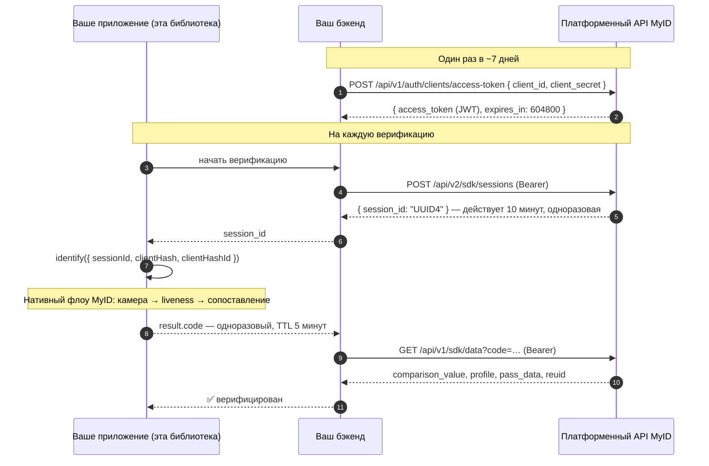

[English](../../README.md) · **Русский** · [O'zbekcha](README.uz.md)

# @softwhere-uz/react-native-myid

> Биометрическая идентификация **MyID** (face liveness / eKYC) для **React Native** и **Expo** — единый типизированный API, первоклассный **конфиг-плагин** для Expo, поддержка New Architecture и актуальные SDK MyID 3.1.x. Проверено end-to-end на реальном железе.

[](https://www.npmjs.com/package/@softwhere-uz/react-native-myid)
[](https://github.com/softwhere-uz/react-native-myid/actions/workflows/ci.yml)
[-blue.svg)](../../LICENSE)
[](../../src/MyId.types.ts)

> [!IMPORTANT]
> **Неофициальный проект.** Эта библиотека **не аффилирована с MyID или ООО UZINFOCOM, не одобрена и не сопровождается ими.** Это независимая, корректно лицензированная обёртка: нативные SDK MyID остаются коммерческим программным обеспечением UZINFOCOM и **подключаются этим пакетом как зависимости, но никогда не распространяются** вместе с ним. См. [Лицензирование](#лицензирование) и [`NOTICE`](../../NOTICE).
>
> **Происхождение.** React Native-мост, который MyID поставляет в своём официальном референсном репозитории [`myid-rn-sdk`](https://gitlab.myid.uz/myid-public-code/myid-rn-sdk), написан автором этого проекта — его файл `ios/MyIdModule.swift` до сих пор начинается со строки `// Created by Kamronbek Juraev on 23/07/24.` Этот пакет — сопровождаемая, оформленная как npm-пакет эволюция той работы, переведённая на сессионный флоу (session flow) 3.1.x.

---

## Содержание

- [Что такое MyID?](#что-такое-myid)
- [Как проходит верификация от начала до конца](#как-проходит-верификация-от-начала-до-конца)
- [Требования](#требования)
- [Установка — Expo](#установка--expo-рекомендуется)
- [Установка — bare React Native](#установка--bare-react-native)
- [Быстрый старт](#быстрый-старт)
- [Ваш бэкенд: выпуск сессии](#ваш-бэкенд-выпуск-сессии)
- [Справочник API](#справочник-api)
- [Обработка ошибок](#обработка-ошибок)
- [Мок-режим](#мок-режим)
- [Справочник по конфиг-плагину](#справочник-по-конфиг-плагину)
- [Устранение неполадок](#устранение-неполадок)
- [Проверено на реальном железе](#проверено-на-реальном-железе)
- [Гайды и статьи](#гайды-и-статьи)
- [Сравнение с другими обёртками](#сравнение-с-другими-обёртками)
- [Чек-лист безопасности](#чек-лист-безопасности)
- [Лицензирование](#лицензирование)

## Что такое MyID?

[MyID](https://myid.uz) — национальная платформа **биометрической идентификации по лицу** Узбекистана, оператором которой выступает **ООО UZINFOCOM** (государственный Единый интегратор): более 19 миллионов пользователей, более 280 миллионов авторизаций; платформой пользуются коммерческие банки, финтех, телеком и государственные сервисы. Её Mobile SDK выполняет **детекцию живости лица (face liveness)** и сверяет пользователя с государственными записями.

Этот пакет оборачивает нативные SDK MyID для iOS и Android (современное поколение **3.1.x на основе сессий**) в один типизированный вызов React Native:

```ts
const result = await identify({ sessionId, clientHash, clientHashId });
// result.code → отправьте на ВАШ бэкенд → GET /api/v1/sdk/data?code=… → верифицированный профиль
```

**MyID — сервис с ограниченным доступом, предоставляемый по договору.** Учётные данные (`clientHash`, `clientHashId`, а также бэкендовые `client_id`/`client_secret`) выдаёт отдел продаж MyID в рамках коммерческого договора. Эта библиотека не может снять это ограничение — и не пытается. Она устраняет другое: *всё трение нативной интеграции* — и в Expo, и в bare React Native.

## Как проходит верификация от начала до конца

MyID 3.1.x работает **на основе сессий**: ваш бэкенд выпускает короткоживущую сессию, устройство проходит по ней биометрический флоу, а затем бэкенд обменивает полученный одноразовый код на данные. Легаси-флоу на стороне SDK с `clientId` и паспортными данными удалён в 3.x.



Полный справочник по платформе: [документация MyID — Mobile SDK (новый флоу)](https://docs.myid.uz/#/en/sdknew).

> [!NOTE]
> **«Поддержка Expo» ≠ Expo Go.** MyID поставляет проприетарный нативный код, поэтому внутри Expo Go он не заработает никогда. Поддержка Expo здесь означает **Continuous Native Generation**: конфиг-плагин + `npx expo prebuild`, запуск в виде development-сборки или сборки EAS.

## Требования

| Что нужно | Откуда | Примечания |
|---|---|---|
| `clientHash`, `clientHashId` | Отдел продаж MyID | Учётные данные для SDK, выдаются по партнёрскому договору с MyID. |
| `client_id`, `client_secret` | Отдел продаж MyID | Учётные данные **только для бэкенда** — для API сессий. Никогда не включайте их в приложение. |
| `sessionId` на каждую верификацию | **Ваш бэкенд** | UUID4, выпускаемый через `POST /api/v2/sdk/sessions`. Одноразовый, живёт 10 минут. |
| Физическое устройство | — | Liveness требует настоящей камеры; симуляторы/эмуляторы не могут пройти флоу. |

**Минимальные версии платформ:** iOS 13.0+ · Android — собственный минимум MyID SDK — minSdk 21; на практике определяющим является минимум вашего React Native/Expo-проекта · React Native 0.74+ (New Architecture и legacy) · работает в Expo (development-сборки / EAS) и в bare React Native. Зафиксированные SDK: iOS — CocoaPods [`MyIdSDK ~> 3.1.3`](https://cocoapods.org/pods/MyIdSDK), Android — `uz.myid.sdk.capture:myid-capture-sdk:3.1.9` из официального репозитория `artifactory.myid.uz` (варианты release/debug разведены корректно; версия никогда не резолвится через `+`, поэтому бета не может незаметно попасть в вашу сборку).

## Установка — Expo (рекомендуется)

```sh
npx expo install @softwhere-uz/react-native-myid
```

Добавьте конфиг-плагин в конфигурацию приложения:

```jsonc
// app.json
{
  "expo": {
    "plugins": [
      [
        "@softwhere-uz/react-native-myid",
        { "cameraPermission": "We use the camera to verify your identity with MyID." }
      ]
    ]
  }
}
```

```sh
npx expo prebuild        # генерирует ios/ + android/ с полной конфигурацией
npx expo run:ios         # development-сборка — не Expo Go
```

На этом вся нативная настройка закончена. Плагин выполняет каждый шаг, который требуют SDK MyID, — включая три шага для iOS, в которых интеграции ошибаются чаще всего:

| # | Что делает плагин | Зачем |
|---|---|---|
| 1 | iOS: **статические фреймворки** на уровне всего приложения (`ios.useFrameworks: "static"`) | `MyIdSDK.xcframework` (бинарный Swift) требует статической линковки. |
| 2 | iOS: `NSCameraUsageDescription` (+ опциональная строка для микрофона) | Обязательно для публикации в App Store; без этого захват лица не работает. |
| 3 | iOS: **манифест приватности** — required-reason API (`0A2A.1`, `35F9.1`, `85F4.1`, `CA92.1`) | Извлечены дословно из поставляемого `MyIdSDK.xcframework`. При статических фреймворках Apple ненадёжно читает собственный манифест пода — декларировать эти API должно приложение. |
| 4 | iOS: опциональный обходной путь `post_install` для связки Firebase и статических фреймворков | По умолчанию выключен; см. [справочник по конфиг-плагину](#справочник-по-конфиг-плагину). |
| 5 | Android: разрешения `CAMERA` + `INTERNET` | Требуются SDK. |
| 6 | Android: официальный Maven-репозиторий MyID в `allprojects.repositories` | Отдаёт артефакт `myid-capture-sdk`. |

Все модификации **идемпотентны** (повторный запуск `prebuild` безопасен) и покрыты юнит-тестами.

## Установка — bare React Native

Библиотека представляет собой [Expo Module](https://docs.expo.dev/modules/overview/), который работает и в bare React Native-приложениях — именно этот путь [проверен на реальном устройстве](#проверено-на-реальном-железе).

```sh
npm install @softwhere-uz/react-native-myid
npx install-expo-modules@latest   # однократно: добавляет рантайм Expo Modules в bare-приложение
```

Затем настройте нативные проекты (один раз):

**iOS** — в `ios/Podfile` включите статические фреймворки на уровне всего приложения, затем установите поды. `MyIdSDK` подтягивается из CocoaPods trunk автоматически подспеком этого пакета:

```ruby
use_frameworks! :linkage => :static
```

```sh
cd ios && pod install
```

- Добавьте `NSCameraUsageDescription` в `Info.plist`.
- Добавьте четыре required-reason-записи в `PrivacyInfo.xcprivacy` (категории `FileTimestamp` → `0A2A.1`, `SystemBootTime` → `35F9.1`, `DiskSpace` → `85F4.1`, `UserDefaults` → `CA92.1`) — или скопируйте их из [исходника плагина](../../plugin/src/index.ts), который является единственным источником истины.

> [!TIP]
> **Xcode 26:** если `AppDelegate.swift` не компилируется с ошибкой *«ambiguous implicit access level for import of 'Expo'»*, замените первую строку на `internal import Expo`. Кодмод `install-expo-modules` пишет обычный `import`, который при статических фреймворках неоднозначен по правилам Swift для импортов с уровнем доступа (access-level imports).

**Android** — добавьте официальный Maven-репозиторий MyID в корневой `build.gradle`; сама зависимость SDK объявляется этим пакетом:

```groovy
allprojects {
  repositories {
    maven { url "https://artifactory.myid.uz/artifactory/myid" }
  }
}
```

Разрешения на камеру и интернет объявлены в манифесте библиотеки и мерджатся автоматически. Запрашивайте разрешение на камеру в рантайме до вызова `identify()` (или позвольте флоу MyID запросить его самостоятельно).

## Быстрый старт

```tsx
import {
  identify,
  isMyIdError,
  type MyIdConfig,
  type MyIdResult,
} from '@softwhere-uz/react-native-myid';

export async function verifyUser(sessionId: string): Promise<MyIdResult | null> {
  const config: MyIdConfig = {
    sessionId,                    // UUID4, выпущенный ВАШИМ бэкендом (см. следующий раздел)
    clientHash: MYID_CLIENT_HASH, // выдаётся отделом продаж MyID
    clientHashId: MYID_CLIENT_HASH_ID,
    environment: 'SANDBOX',       // 'PRODUCTION' для боевых договоров
    locale: 'UZ',                 // 'UZ' | 'RU' | 'EN'
  };

  try {
    const result = await identify(config);
    // result.code — ОДНОРАЗОВЫЙ код (TTL 5 минут).
    // Обменяйте его на данные со своего бэкенда: GET /api/v1/sdk/data?code=…
    // НИКОГДА не доверяйте только клиентскому результату.
    return result;
  } catch (error) {
    if (isMyIdError(error)) {
      switch (error.kind) {
        case 'cancelled':   return null;                    // пользователь закрыл флоу — это норма
        case 'permission':  throw new Error('Camera permission is required.');
        case 'network':     throw new Error('Connection problem — try again.');
        default:            throw new Error(`MyID failed (${error.code ?? error.kind}): ${error.message}`);
      }
    }
    throw error;
  }
}
```

Пользователь, закрывший флоу, — это **полноценный исход** (`kind: 'cancelled'`), а не краш и не безликая ошибка — ваша аналитика воронки скажет вам спасибо.

## Ваш бэкенд: выпуск сессии

Сессии выпускаются **бэкенд-к-бэкенду** с вашими учётными данными MyID API ([официальная документация](https://docs.myid.uz/#/en/sdknew)). Минимальный набросок на Node/TypeScript:

```ts
// 1) Токен доступа — кэшируйте его; он живёт 7 дней (expires_in: 604800).
const { access_token } = await fetch(`${MYID_HOST}/api/v1/auth/clients/access-token`, {
  method: 'POST',
  headers: { 'Content-Type': 'application/json' },
  body: JSON.stringify({
    client_id: process.env.MYID_CLIENT_ID,        // переменные окружения бэкенда —
    client_secret: process.env.MYID_CLIENT_SECRET, // НИКОГДА не в мобильном приложении
  }),
}).then(r => r.json());

// 2) Сессия — одноразовая, действует 10 минут. Пустое тело = SDK покажет
//    собственный экран ввода паспорта; либо предзаполните pass_data/pinfl + birth_date.
const { session_id } = await fetch(`${MYID_HOST}/api/v2/sdk/sessions`, {
  method: 'POST',
  headers: { Authorization: `Bearer ${access_token}`, 'Content-Type': 'application/json' },
  body: JSON.stringify({}),
}).then(r => r.json());
// → передайте session_id (UUID4) приложению для identify()

// 3) После того как приложение вернёт result.code (одноразовый, TTL 5 минут):
const profile = await fetch(`${MYID_HOST}/api/v1/sdk/data?code=${code}`, {
  headers: { Authorization: `Bearer ${access_token}` },
}).then(r => r.json());
// → profile.comparison_value, profile.profile.*, profile.reuid (для
//   Secondary Request Flow — повторной верификации известного пользователя без паспортных данных)
```

Если приложение так и не вернулось (краш, пользователь бросил флоу), восстановитесь на стороне сервера: `GET /api/v1/sdk/sessions/{session_id}` → `{ code, status: 'in_progress' | 'closed' | 'expired', attempts[] }`.

## Справочник API

### `identify(config: MyIdConfig): Promise<MyIdResult>`

Запускает нативный флоу MyID. Резолвится при успехе; во всех остальных случаях — включая отмену пользователем — отклоняется с ошибкой [`MyIdError`](#обработка-ошибок). Конфиг валидируется до перехода через мост (некорректный ввод отклоняется с `kind: 'config'` и никогда не роняет нативный код).

### `MyIdConfig`

| Поле | Тип | По умолчанию | Примечания |
|---|---|---|---|
| `sessionId` | `string` | **обязательное** | UUID4, выпускаемый вашим бэкендом на каждую верификацию. Одноразовый. |
| `clientHash` | `string` | **обязательное** | Выдаётся отделом продаж MyID. |
| `clientHashId` | `string` | **обязательное** | Выдаётся отделом продаж MyID. |
| `environment` | `'SANDBOX' \| 'PRODUCTION'` | `'PRODUCTION'` | Должно совпадать со средой, в которой была выпущена сессия. |
| `entryType` | `'IDENTIFICATION' \| 'FACE_DETECTION' \| 'VIDEO_IDENTIFICATION'` | `'IDENTIFICATION'` | `VIDEO_IDENTIFICATION` требует дополнительный видео-SDK на Android. |
| `locale` | `'UZ' \| 'RU' \| 'EN'` | значение SDK по умолчанию (узбекский) | Язык интерфейса флоу. |
| `residency` | `'RESIDENT' \| 'NON_RESIDENT' \| 'USER_DEFINED'` | значение SDK по умолчанию | Подсказка о резидентстве. |
| `cameraShape` | `'CIRCLE' \| 'ELLIPSE'` | значение SDK по умолчанию | Форма выреза при захвате лица. |
| `cameraSelector` | `'FRONT' \| 'BACK'` | `'FRONT'` | Для liveness обычно используется фронтальная камера. |
| `minAge` | `number` | значение SDK по умолчанию (16) | Минимальный допустимый возраст. |
| `distance` | `number` | значение SDK по умолчанию | Порог расстояния до лица. |
| `showErrorScreen` | `boolean` | значение SDK по умолчанию | Показывать ли собственный экран ошибки SDK перед возвратом. |
| `organizationDetails` | `{ phoneNumber?, logo? }` | — | Брендирование внутри флоу. |
| `appearance` | [`MyIdAppearance`](../../src/MyId.types.ts) | — | Цвета + скругление кнопок. На iOS применяется программно; на Android темизация в основном опирается на XML-ресурсы, поэтому часть полей там может игнорироваться. |
| `huaweiAppId` | `string` | — | **Только Android/HMS** — для устройств без Google Play. На iOS игнорируется. |

### `MyIdResult`

| Поле | Тип | Примечания |
|---|---|---|
| `code` | `string` | Одноразовый код идентификации (TTL 5 минут). **Обменивайте его на сервере** через `GET /api/v1/sdk/data?code=…`. |
| `base64Image` | `string?` | Снятый портрет лица, нормализованный к **PNG без data-URI-префикса на обеих платформах** (референсы апстрима расходятся: iOS отдаёт JPEG, Android — PNG; эта библиотека нормализует результат). |
| `comparison` | `number?` | Оценка совпадения лица, когда SDK её возвращает (на iOS 3.1.3 отсутствует). Авторитетное значение `comparison_value` приходит из бэкенд-эндпоинта данных. |

## Обработка ошибок

`identify()` отклоняется с единственным, безопасным для сериализации типом ошибки:

```ts
class MyIdError extends Error {
  kind: 'cancelled' | 'permission' | 'network' | 'sdk' | 'no_activity' | 'config' | 'unknown';
  code?: number;          // сырой код MyID SDK, если есть
  nativeMessage?: string; // сырое сообщение SDK, если есть
}

isMyIdError(e: unknown): e is MyIdError  // надёжно работает через границы моста/realm
```

| `kind` | Значение | Типичная обработка |
|---|---|---|
| `cancelled` | Пользователь вышел из флоу. | Не ошибка — вернитесь на предыдущий экран. |
| `permission` | Отказано в доступе к камере (код SDK **102**). | Предложите включить камеру в настройках. |
| `network` | Сбой соединения/транспорта. | Предложите повторить попытку. |
| `sdk` | MyID SDK сообщил об ошибке — смотрите `code` + `nativeMessage`. | Ветвитесь по `code`; показывайте понятное пользователю сообщение. |
| `no_activity` | На Android не было Activity на переднем плане. | Повторите, когда приложение снова на переднем плане. |
| `config` | Некорректный `MyIdConfig` (перехватывается **до** нативного вызова). | Исправьте место вызова. |
| `unknown` | Всё остальное. | Отправляйте в отчёты вместе с `nativeMessage`. |

**Коды MyID SDK**, с которыми вы реально встретитесь (из [официальной таблицы](https://docs.myid.uz/#/en/sdknew)): `101` — внутренняя ошибка SDK · `102` — отказано в доступе к камере · `103` — универсальная ошибка сервера/SDK — *официальная рекомендация — читать сообщение, сопровождающее 103* (эта библиотека сохраняет его в `nativeMessage`) · `122` — пользователь заблокирован (`ttl` из SDK содержит обратный отсчёт до снятия бана). Полный справочник бэкендовых `result_code` — в [документации MyID](https://docs.myid.uz/#/ru/embedded?id=javob-kodlar-uz-result_code).

Реальные примеры, снятые на устройстве в среде SANDBOX:

```text
kind=sdk  code=103  nativeMessage="Input should be a valid UUID, …"   ← sessionId не был UUID
kind=sdk  code=103  nativeMessage="Session is expired"                ← корректный UUID, который бэкенд не выпускал / старше 10 минут
```

## Мок-режим

Собирайте и демонстрируйте UI успеха/ошибки/отмены **без договора с MyID и без устройства** — мок-режим вообще не обращается к нативному коду:

```ts
import { setMockMode, identify } from '@softwhere-uz/react-native-myid';

setMockMode({ outcome: 'success', delayMs: 800 });        // или 'cancelled' | 'permission' | 'network' | 'sdk' | …
const result = await identify(config);                     // резолвит фиктивный результат (включая образец PNG с лицом)

setMockMode({ outcome: 'sdk', code: 103, message: 'Mocked failure' });
setMockMode(null);                                         // назад к реальному флоу
```

`MyIdMockScenario` поддерживает `outcome`, `delayMs`, переопределение `result` для успеха и `code`/`message` для сбоев. Никогда не включайте его в продакшен-сборках. В приложении [`example/`](../../example) на его основе собран переключатель сценариев.

## Справочник по конфиг-плагину

```jsonc
["@softwhere-uz/react-native-myid", {
  "cameraPermission": "…",       // iOS NSCameraUsageDescription (есть разумное значение по умолчанию)
  "microphonePermission": "…",   // iOS — добавляется, только если задано; face liveness в MyID использует лишь камеру
  "androidMavenUrl": "…",        // по умолчанию: https://artifactory.myid.uz/artifactory/myid
  "firebaseWorkaround": false    // опциональный post_install в Podfile для связки «статические фреймворки × Firebase»
}]
```

| Проп | Тип | По умолчанию | Описание |
|---|---|---|---|
| `cameraPermission` | `string` | разумное значение по умолчанию | Описание использования камеры для iOS. |
| `microphonePermission` | `string` | — (не добавляется) | По умолчанию выключено — все проверенные нами источники по MyID 3.x используют только камеру. |
| `androidMavenUrl` | `string` | официальный Artifactory MyID | **Никогда не указывайте учётные данные в Maven-URL** — они утекают в APK/AAB. Репозиторий по умолчанию открыт на чтение. |
| `firebaseWorkaround` | `boolean` | `false` | Внедряет `CLANG_ALLOW_NON_MODULAR_INCLUDES_IN_FRAMEWORK_MODULES = YES` в `post_install` — стандартный обходной путь для конфликта «статические фреймворки на уровне приложения × Firebase» (немодульные заголовки). |

## Устранение неполадок

| Симптом | Причина → решение |
|---|---|
| `kind=sdk, code=103, "Input should be a valid UUID…"` | `sessionId` — не UUID. Выпустите его через `POST /api/v2/sdk/sessions` — не придумывайте сами. |
| `kind=sdk, code=103, "Session is expired"` | Сессия не выпускалась в этой среде, уже была использована (она одноразовая) или старше 10 минут. Выпускайте новую на каждую попытку и проверяйте, что `environment` совпадает со средой, где она выпущена. |
| Флоу мгновенно закрывается в SANDBOX | Сессия выпущена в продакшене, а `environment: 'SANDBOX'` (или наоборот). |
| Нативный модуль не найден / `requireNativeModule('MyId')` бросает исключение | Вы в Expo Go (он не поддерживается в принципе) или не пересобрали приложение после установки. Создайте development-сборку: `npx expo prebuild && npx expo run:ios`. |
| Сборка iOS: ошибки немодульных заголовков с Firebase | Требование статических фреймворков конфликтует с подами Firebase → установите `firebaseWorkaround: true` и пересоберите. |
| Bare RN + Xcode 26: `ambiguous implicit access level for import of 'Expo'` | Замените первую строку `AppDelegate.swift` на `internal import Expo`. |
| Android: артефакт MyID не резолвится при `repositoriesMode = FAIL_ON_PROJECT_REPOS` | Ваш `settings.gradle` запрещает репозитории на уровне проекта. Добавьте Maven-URL MyID в `dependencyResolutionManagement.repositories` в `settings.gradle`. |
| Эмулятор Android / симулятор iOS не может завершить флоу | Ожидаемо — liveness требует физическую камеру. Для работы над UI используйте [мок-режим](#мок-режим). |

## Проверено на реальном железе

Это не обёртка «из одних типов». **2026-07-22** библиотека прошла сквозное (E2E) тестирование на физическом iPhone (iOS 26.5) в **обоих** поддерживаемых сценариях:

- **Expo**: приложение [`example/`](../../example) — конфиг-плагин → `expo prebuild` → сборка на устройство.
- **Bare React Native 0.86**: свежее приложение на RN CLI, установленное **из упакованного npm-тарбола**, по bare-инструкции выше.

В каждом сценарии проверено: регистрация нативного модуля, весь мок-API, валидация конфига, отображение типизированных ошибок и **реальный вызов `MyIdClient.start`**, чей полный круговой путь дошёл до SANDBOX-бэкенда MyID и вернулся корректной типизированной ошибкой (`"Session is expired"` — правильный ответ на невыпущенную сессию). Единственный путь, требующий действующего договора с MyID, — успешный захват лица — это ровно тот путь, который держатель договора получает, подставив реальный `sessionId` в [быстрый старт](#быстрый-старт).

## Гайды и статьи

- [MyID in React Native and Expo: the complete integration guide (2026)](https://medium.com/@kamuranbek1998/myid-in-react-native-and-expo-the-complete-integration-guide-2026-5efabc862cfb) — сессионный флоу, оба пути установки, обработка ошибок и заметки из практики; статья на Medium.

## Сравнение с другими обёртками

Каждое утверждение ниже проверено по опубликованным npm-тарболам, реестрам и репозиториям по состоянию на **2026-07-22** — подробности в [`docs/`](../../docs).

| Пакет | Сессионный флоу MyID 3.1.x | Конфиг-плагин Expo | Типизированные ошибки + полноценная отмена | Автоматизация нативной настройки | Статус (проверено 2026-07-22) |
|---|---|---|---|---|---|
| **`@softwhere-uz/react-native-myid`** | ✅ обе платформы | ✅ полный (статические фреймворки, разрешения, манифест приватности, Maven) | ✅ объединённый тип `MyIdError`, kind `cancelled` | ✅ Expo: всё · bare: 2 ручных шага | Активен; CI; плагин покрыт юнит-тестами; проверен на устройстве |
| Официальный `myid-rn-sdk` (GitLab) | ❌ легаси-флоу с `clientId` | — (bare-демо, `private: true`, не публикуется в npm) | — | — | Последний коммит 2024-10; RN 0.74.3; SDK 2.3.4 |
| `expo-myid` | ❌ легаси-флоу с `clientId` | ⚠️ частично — добавляет только Maven + под; без разрешений (для них требуется установить `expo-camera`) | ❌ отмена никогда не доходит до JS | ⚠️ частично | Последняя публикация 2024-11; зафиксированный Android-артефакт (`…-bundled:2.3.6`) больше не существует ни на одном из Artifactory-хостов MyID |
| `rn-myid` | ✅ | ❌ | ✅ (промис + `USER_EXITED`) | ⚠️ Maven внедряет сам; `Info.plist` вручную | Последняя публикация 2026-06; по собственному описанию — внутренний инструмент для приложений мейнтейнера |
| `react-native-nitro-myid` | ✅ | ❌ | ⚠️ промис-API теряет числовой код; hook-API полный | ❌ вручную: под, Maven, `Info.plist`, XML-темизация Android | Последняя публикация 2026-06; требует peer-зависимость `react-native-nitro-modules`; исходники на GitHub отстают от npm |
| `@maydon_tech/react-native-myid` | ✅ | ❌ | ✅ (`isUserExit`) | ⚠️ Maven + `Info.plist` вручную; **версия iOS-пода не зафиксирована** | Последняя публикация 2026-04; бросает исключение при импорте, если нативный модуль отсутствует (ломает импорты в Jest/Expo Go) |
| `react-native-myid` | ❌ легаси-флоу с `clientId` | ❌ | ❌ только события | ❌ полностью вручную | Последняя публикация 2025-05; репозиторий на GitHub удалён; зафиксированный Android-артефакт (2.4.1) больше не резолвится; вытеснен пакетом того же автора |

Два структурных отличия, о которых стоит сказать отдельно, — их легко упустить и дорого обнаружить слишком поздно:

1. **Манифест приватности iOS.** При статических фреймворках на уровне всего приложения (которых требует `MyIdSDK.xcframework`) Apple ненадёжно читает собственный `PrivacyInfo.xcprivacy` пода — required-reason API MyID должно декларировать само *приложение*, иначе возможны отказы на ревью в App Store. Эта библиотека — единственная обёртка, которая их внедряет (коды извлечены из поставляемого фреймворка, [исходник](../../plugin/src/index.ts)).
2. **Официальный Maven-хост.** Эта библиотека по умолчанию использует `artifactory.myid.uz` (хост, на который ссылается актуальная документация MyID). Все остальные обёртки указывают на стороннее хост-зеркало.

## Чек-лист безопасности

- **Проверяйте на сервере.** `result.code` — лишь заявление, пока ваш бэкенд не обменял его на данные (`GET /api/v1/sdk/data?code=…`) и не сверил `comparison_value` со своим порогом. Никогда не доверяйте только клиентскому результату.
- **`client_secret` никогда не попадает в приложение** — выпуск сессий выполняется только бэкенд-к-бэкенду (официальное требование).
- **Не логируйте `base64Image`** и не храните его дольше, чем требуют ваши комплаенс-обязательства, — это биометрические персональные данные.
- **Детекция root/эмулятора — ваша зона ответственности** — MyID SDK сознательно её не включает (согласно официальной документации); добавьте собственные проверки, если этого требует ваша модель рисков.
- **Не указывайте учётные данные в Maven-URL** — URL Gradle-репозиториев восстановимы из артефактов сборки.

## Лицензирование

Код в этом репозитории распространяется под лицензией **MIT** — она покрывает **только эту обёртку**: TypeScript API, конфиг-плагин Expo и исходники моста для iOS/Android. **SDK MyID — коммерческое, проприетарное программное обеспечение ООО UZINFOCOM** (лицензия в iOS-подспеке: `Commercial`); этот пакет их **не распространяет** (они резолвятся как внешние зависимости из собственных каналов дистрибуции UZINFOCOM на этапе сборки), а для использования в продакшене требуется партнёрский договор с MyID. См. [`NOTICE`](../../NOTICE).

Если вы из MyID/UZINFOCOM и хотите, чтобы здесь что-то изменилось — название, формулировки или сам пакет, — откройте issue или напишите мейнтейнеру на почту; этот проект существует, чтобы интеграции с MyID становились лучше, а не чтобы конкурировать с официальным продуктом.

## Вклад в проект / разработка

```sh
npm install
npm run build && npm run build:plugin
npm test            # юнит-тесты: API + конфиг-плагин (устройство не нужно)
npm run lint && npm run typecheck
```

Приложение [`example/`](../../example) прогоняет модуль end-to-end с переключателем сценариев (мок-успех/отмена/ошибка + режим реального устройства через `example/.env`). Архитектурные решения и проверенные факты об SDK: [`docs/DECISIONS.md`](../DECISIONS.md).

## Благодарности

**MyID** — продукт **ООО UZINFOCOM**. Это независимая, неофициальная обёртка; названия продуктов используются номинативно. Автор ранее написал референсный React Native-мост, поставляемый в официальном публичном репозитории MyID.
