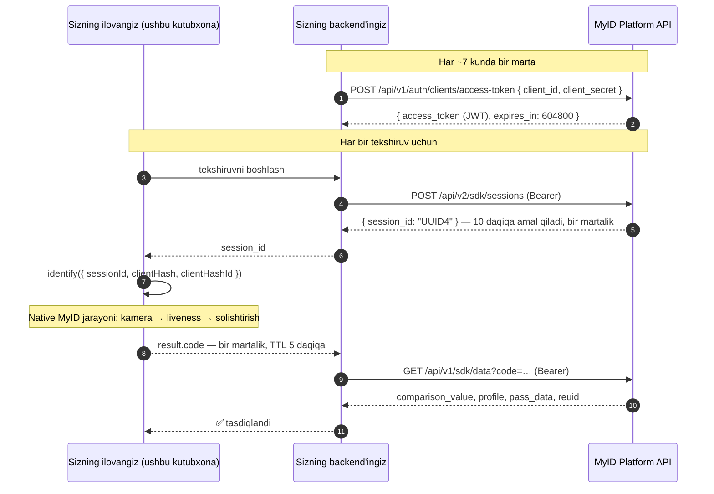

[English](../../README.md) · [Русский](README.ru.md) · **O'zbekcha**

# @softwhere-uz/react-native-myid

> **MyID** biometrik identifikatsiyasi (yuz liveness'i / eKYC) **React Native** va **Expo** uchun — yagona typed API, to'laqonli Expo **config plugin**, New Architecture qo'llab-quvvatlashi va joriy MyID 3.1.x SDK'lari. Haqiqiy qurilmada boshdan-oxirigacha (end-to-end) tekshirilgan.

[](https://www.npmjs.com/package/@softwhere-uz/react-native-myid)
[](https://github.com/softwhere-uz/react-native-myid/actions/workflows/ci.yml)
[-blue.svg)](../../LICENSE)
[](../../src/MyId.types.ts)

> [!IMPORTANT]
> **Norasmiy.** Ushbu kutubxona **MyID yoki UZINFOCOM MChJ bilan bog'liq emas, ular tomonidan tasdiqlanmagan va qo'llab-quvvatlanmaydi.** Bu mustaqil, litsenziya jihatidan to'g'ri rasmiylashtirilgan wrapper: native MyID SDK'lari UZINFOCOM'ning tijorat dasturiy ta'minoti bo'lib qoladi va ushbu paket ularga **faqat havola qiladi, hech qachon qayta tarqatmaydi**. Qarang: [Litsenziyalash](#litsenziyalash) va [`NOTICE`](../../NOTICE).
>
> **Kelib chiqishi.** MyID o'zining rasmiy [`myid-rn-sdk`](https://gitlab.myid.uz/myid-public-code/myid-rn-sdk) reference repozitoriysida yetkazib beradigan React Native bridge ushbu loyiha muallifi tomonidan yozilgan — undagi `ios/MyIdModule.swift` fayli hozir ham `// Created by Kamronbek Juraev on 23/07/24.` qatori bilan boshlanadi. Ushbu paket — o'sha ishning qo'llab-quvvatlanadigan, paketlangan, session-flow (3.1.x) evolyutsiyasi.

---

## Mundarija

- [MyID nima?](#myid-nima)
- [Tekshiruv boshidan oxirigacha qanday ishlaydi](#tekshiruv-boshidan-oxirigacha-qanday-ishlaydi)
- [Talablar](#talablar)
- [O'rnatish — Expo](#ornatish--expo-tavsiya-etiladi)
- [O'rnatish — bare React Native](#ornatish--bare-react-native)
- [Tezkor boshlash](#tezkor-boshlash)
- [Sizning backend'ingiz: session yaratish](#sizning-backendingiz-session-yaratish)
- [API ma'lumotnomasi](#api-malumotnomasi)
- [Xatoliklar bilan ishlash](#xatoliklar-bilan-ishlash)
- [Mock rejimi](#mock-rejimi)
- [Config plugin ma'lumotnomasi](#config-plugin-malumotnomasi)
- [Muammolarni bartaraf etish](#muammolarni-bartaraf-etish)
- [Haqiqiy qurilmada tekshirilgan](#haqiqiy-qurilmada-tekshirilgan)
- [Qo'llanmalar va maqolalar](#qollanmalar-va-maqolalar)
- [Boshqa wrapper'lar bilan taqqoslash](#boshqa-wrapperlar-bilan-taqqoslash)
- [Xavfsizlik cheklisti](#xavfsizlik-cheklisti)
- [Litsenziyalash](#litsenziyalash)

## MyID nima?

[MyID](https://myid.uz) — O'zbekistonning milliy **biometrik yuz identifikatsiyasi** platformasi bo'lib, **UZINFOCOM MChJ** (davlat Yagona integratori) tomonidan boshqariladi — 19+ million foydalanuvchi, 280+ million avtorizatsiya; tijorat banklari, fintech, telekom va davlat xizmatlarida qo'llaniladi. Uning Mobile SDK'si **yuz liveness tekshiruvini** bajaradi va foydalanuvchini davlat ma'lumotlari bilan solishtiradi.

Ushbu paket native MyID iOS va Android SDK'larini (zamonaviy, **session'ga asoslangan 3.1.x** avlodini) yagona typed React Native chaqiruvi ortiga o'raydi:

```ts
const result = await identify({ sessionId, clientHash, clientHashId });
// result.code → SIZNING backend'ingizga yuboring → GET /api/v1/sdk/data?code=… → tasdiqlangan profil
```

**MyID — shartnoma asosidagi, kirishi cheklangan xizmat.** Hisob ma'lumotlari (`clientHash`, `clientHashId` hamda backend uchun `client_id`/`client_secret`) MyID savdo jamoasi tomonidan tijorat shartnomasi asosida beriladi. Ushbu kutubxona bu to'siqni olib tashlay olmaydi — va bunga urinmaydi ham. U olib tashlaydigan narsa — *native integratsiyaning barcha qiyinchiliklari*, ham Expo'da, ham bare React Native'da.

## Tekshiruv boshidan oxirigacha qanday ishlaydi

MyID 3.1.x **session'ga asoslangan**: backend'ingiz qisqa muddatli session yaratadi, qurilma shu session bo'yicha biometrik jarayonni bajaradi, so'ngra backend'ingiz natijada olingan bir martalik kodni almashtiradi. SDK tomonidagi eski `clientId` + pasport ma'lumotlari oqimi 3.x versiyada olib tashlangan.



To'liq platforma ma'lumotnomasi: [MyID hujjatlari — Mobile SDK (yangi oqim)](https://docs.myid.uz/#/en/sdknew).

> [!NOTE]
> **«Expo qo'llab-quvvatlashi» ≠ Expo Go.** MyID proprietar native kod bilan yetkaziladi, shu sababli u hech qachon Expo Go ichida ishlay olmaydi. Bu yerda Expo qo'llab-quvvatlashi **Continuous Native Generation** degani: config plugin + `npx expo prebuild`, development build yoki EAS build sifatida ishga tushiriladi.

## Talablar

| Sizga kerak | Kimdan | Izohlar |
|---|---|---|
| `clientHash`, `clientHashId` | MyID savdo jamoasi | SDK tomonidagi hisob ma'lumotlari, MyID hamkorlik shartnomasi asosida beriladi. |
| `client_id`, `client_secret` | MyID savdo jamoasi | Session API uchun **faqat backend'da** ishlatiladigan hisob ma'lumotlari. Hech qachon ularni ilova ichida jo'natmang. |
| Har bir tekshiruv uchun `sessionId` | **Sizning backend'ingiz** | `POST /api/v2/sdk/sessions` orqali yaratilgan UUID4. Bir martalik, amal qilish muddati 10 daqiqa. |
| Jismoniy qurilma | — | Liveness haqiqiy kamera talab qiladi; simulator/emulatorlar jarayonni yakunlay olmaydi. |

**Platforma minimumlari:** iOS 13.0+ · Android — MyID SDK'ning o'z minimumi minSdk 21; amalda React Native/Expo loyihangizning minimal qiymati hal qiluvchi · React Native 0.74+ (New Architecture va legacy) · Expo'da (dev build / EAS) hamda bare React Native'da ishlaydi. Qadab qo'yilgan (pinned) SDK'lar: iOS CocoaPods [`MyIdSDK ~> 3.1.3`](https://cocoapods.org/pods/MyIdSDK), Android `uz.myid.sdk.capture:myid-capture-sdk:3.1.9` rasmiy `artifactory.myid.uz` repozitoriysidan (release/debug variantlari to'g'ri ajratilgan; hech qachon `+` bilan resolve qilinmaydi, shuning uchun beta versiya build'ingizga hech qachon sizib kira olmaydi).

## O'rnatish — Expo (tavsiya etiladi)

```sh
npx expo install @softwhere-uz/react-native-myid
```

App config'ingizga config plugin'ni qo'shing:

```jsonc
// app.json
{
  "expo": {
    "plugins": [
      [
        "@softwhere-uz/react-native-myid",
        { "cameraPermission": "We use the camera to verify your identity with MyID." }
      ]
    ]
  }
}
```

```sh
npx expo prebuild        # to'liq sozlangan ios/ + android/ papkalarini generatsiya qiladi
npx expo run:ios         # development build — Expo Go emas
```

Native sozlashning hammasi shu. Plugin MyID SDK'lari talab qiladigan har bir qadamni bajaradi — jumladan, ko'pchilik integratsiyalarda xato qilinadigan uchta iOS qadamini ham:

| # | Plugin nima qiladi | Nima uchun |
|---|---|---|
| 1 | iOS: ilova darajasidagi **static frameworks** (`ios.useFrameworks: "static"`) | `MyIdSDK.xcframework` (Swift binary) static linkage talab qiladi. |
| 2 | iOS: `NSCameraUsageDescription` (+ ixtiyoriy mikrofon matni) | App Store'ga topshirish uchun majburiy; yuzni suratga olish uchun kerak. |
| 3 | iOS: **privacy manifest** required-reason API'lari (`0A2A.1`, `35F9.1`, `85F4.1`, `CA92.1`) | Yetkazib berilgan `MyIdSDK.xcframework`'dan so'zma-so'z olingan. Static frameworks ostida Apple pod'ning o'z manifestini ishonchli o'qimaydi — bularni ilovaning o'zi e'lon qilishi kerak. |
| 4 | iOS: ixtiyoriy Firebase/static-frameworks `post_install` yechimi | Default holda o'chirilgan; qarang: [plugin ma'lumotnomasi](#config-plugin-malumotnomasi). |
| 5 | Android: `CAMERA` + `INTERNET` ruxsatlari | SDK talab qiladi. |
| 6 | Android: `allprojects.repositories` ichida rasmiy MyID Maven repozitoriysi | `myid-capture-sdk` artefaktini taqdim etadi. |

Barcha modifikatsiyalar **idempotent** (`prebuild`ni qayta ishga tushirish xavfsiz) va unit testlar bilan qoplangan.

## O'rnatish — bare React Native

Kutubxona [Expo Module](https://docs.expo.dev/modules/overview/) bo'lib, bare React Native ilovalarida ham ishlaydi — aynan shu yo'l [haqiqiy qurilmada tekshirilgan](#haqiqiy-qurilmada-tekshirilgan).

```sh
npm install @softwhere-uz/react-native-myid
npx install-expo-modules@latest   # bir martalik: bare ilovaga Expo Modules runtime'ini qo'shadi
```

So'ngra native loyihalarni sozlang (bir marta):

**iOS** — `ios/Podfile` faylida ilova darajasidagi static frameworks'ni yoqing, so'ng pod'larni o'rnating. `MyIdSDK` ushbu paketning podspec'i orqali CocoaPods trunk'dan avtomatik tortib olinadi:

```ruby
use_frameworks! :linkage => :static
```

```sh
cd ios && pod install
```

- `Info.plist`ga `NSCameraUsageDescription` qo'shing.
- `PrivacyInfo.xcprivacy`ga to'rtta required-reason yozuvini qo'shing (kategoriyalar: `FileTimestamp` → `0A2A.1`, `SystemBootTime` → `35F9.1`, `DiskSpace` → `85F4.1`, `UserDefaults` → `CA92.1`) — yoki ularni yagona haqiqat manbai bo'lgan [plugin manbasidan](../../plugin/src/index.ts) nusxalab oling.

> [!TIP]
> **Xcode 26:** agar `AppDelegate.swift` *"ambiguous implicit access level for import of 'Expo'"* xatosi bilan yiqilsa, 1-qatorni `internal import Expo`ga o'zgartiring. `install-expo-modules` codemod'i oddiy `import` yozadi, bu esa static frameworks bilan Swift'ning access-level-imports qoidalari ostida noaniq (ambiguous) hisoblanadi.

**Android** — root `build.gradle`ga rasmiy MyID Maven repozitoriysini qo'shing; SDK dependency'ning o'zi ushbu paket tomonidan e'lon qilinadi:

```groovy
allprojects {
  repositories {
    maven { url "https://artifactory.myid.uz/artifactory/myid" }
  }
}
```

Kamera va Internet ruxsatlari kutubxona manifestida e'lon qilingan va avtomatik merge bo'ladi. `identify()`ni chaqirishdan oldin kamera ruxsatini runtime'da so'rang (yoki MyID jarayonining o'zi so'rashiga qo'yib bering).

## Tezkor boshlash

```tsx
import {
  identify,
  isMyIdError,
  type MyIdConfig,
  type MyIdResult,
} from '@softwhere-uz/react-native-myid';

export async function verifyUser(sessionId: string): Promise<MyIdResult | null> {
  const config: MyIdConfig = {
    sessionId,                    // SIZNING backend'ingiz yaratgan UUID4 (keyingi bo'limga qarang)
    clientHash: MYID_CLIENT_HASH, // MyID savdo jamoasi tomonidan beriladi
    clientHashId: MYID_CLIENT_HASH_ID,
    environment: 'SANDBOX',       // jonli shartnomalar uchun 'PRODUCTION'
    locale: 'UZ',                 // 'UZ' | 'RU' | 'EN'
  };

  try {
    const result = await identify(config);
    // result.code — BIR MARTALIK kod (TTL 5 daqiqa).
    // Uni backend'ingizdan almashtiring: GET /api/v1/sdk/data?code=…
    // HECH QACHON faqat klient natijasiga ishonmang.
    return result;
  } catch (error) {
    if (isMyIdError(error)) {
      switch (error.kind) {
        case 'cancelled':   return null;                    // foydalanuvchi jarayonni yopdi — normal holat
        case 'permission':  throw new Error('Camera permission is required.');
        case 'network':     throw new Error('Connection problem — try again.');
        default:            throw new Error(`MyID failed (${error.code ?? error.kind}): ${error.message}`);
      }
    }
    throw error;
  }
}
```

Foydalanuvchining jarayonni yopishi — **birinchi darajali natija** (`kind: 'cancelled'`), crash ham emas, umumiy xatolik ham emas — funnel analitikangiz buning uchun rahmat aytadi.

## Sizning backend'ingiz: session yaratish

Session'lar MyID API hisob ma'lumotlaringiz bilan **backend'dan backend'ga** yaratiladi ([rasmiy hujjatlar](https://docs.myid.uz/#/en/sdknew)). Minimal Node/TypeScript namunasi:

```ts
// 1) Access token — keshlab qo'ying; u 7 kun amal qiladi (expires_in: 604800).
const { access_token } = await fetch(`${MYID_HOST}/api/v1/auth/clients/access-token`, {
  method: 'POST',
  headers: { 'Content-Type': 'application/json' },
  body: JSON.stringify({
    client_id: process.env.MYID_CLIENT_ID,        // backend env o'zgaruvchilari —
    client_secret: process.env.MYID_CLIENT_SECRET, // HECH QACHON mobil ilovada emas
  }),
}).then(r => r.json());

// 2) Session — bir martalik, 10 daqiqa amal qiladi. Bo'sh body = SDK o'zining
//    pasport kiritish ekranini ko'rsatadi; yoki pass_data/pinfl + birth_date bilan oldindan to'ldiring.
const { session_id } = await fetch(`${MYID_HOST}/api/v2/sdk/sessions`, {
  method: 'POST',
  headers: { Authorization: `Bearer ${access_token}`, 'Content-Type': 'application/json' },
  body: JSON.stringify({}),
}).then(r => r.json());
// → session_id (UUID4) ni identify() uchun ilovaga uzating

// 3) Ilova result.code qaytargandan so'ng (bir martalik, TTL 5 daqiqa):
const profile = await fetch(`${MYID_HOST}/api/v1/sdk/data?code=${code}`, {
  headers: { Authorization: `Bearer ${access_token}` },
}).then(r => r.json());
// → profile.comparison_value, profile.profile.*, profile.reuid (Secondary
//   Request Flow uchun — ma'lum foydalanuvchini pasport ma'lumotlarisiz qayta tekshirish)
```

Agar ilova qaytib kelmasa (crash, foydalanuvchi tashlab ketishi), server tomonida tiklang: `GET /api/v1/sdk/sessions/{session_id}` → `{ code, status: 'in_progress' | 'closed' | 'expired', attempts[] }`.

## API ma'lumotnomasi

### `identify(config: MyIdConfig): Promise<MyIdResult>`

Native MyID jarayonini ishga tushiradi. Muvaffaqiyatda resolve bo'ladi; aks holda — jumladan, foydalanuvchi bekor qilganda ham — [`MyIdError`](#xatoliklar-bilan-ishlash) bilan reject bo'ladi. Config bridge'dan o'tishdan oldin validatsiya qilinadi (noto'g'ri input `kind: 'config'` bilan reject bo'ladi, hech qachon native crash emas).

### `MyIdConfig`

| Maydon | Turi | Default | Izohlar |
|---|---|---|---|
| `sessionId` | `string` | **majburiy** | Har bir tekshiruv uchun backend'ingiz tomonidan yaratiladigan UUID4. Bir martalik. |
| `clientHash` | `string` | **majburiy** | MyID savdo jamoasi tomonidan beriladi. |
| `clientHashId` | `string` | **majburiy** | MyID savdo jamoasi tomonidan beriladi. |
| `environment` | `'SANDBOX' \| 'PRODUCTION'` | `'PRODUCTION'` | Session qaysi muhitda yaratilgan bo'lsa, o'shanga mos kelishi kerak. |
| `entryType` | `'IDENTIFICATION' \| 'FACE_DETECTION' \| 'VIDEO_IDENTIFICATION'` | `'IDENTIFICATION'` | `VIDEO_IDENTIFICATION` Android'da qo'shimcha video SDK talab qiladi. |
| `locale` | `'UZ' \| 'RU' \| 'EN'` | SDK default'i (o'zbekcha) | Jarayonning UI tili. |
| `residency` | `'RESIDENT' \| 'NON_RESIDENT' \| 'USER_DEFINED'` | SDK default'i | Rezidentlik bo'yicha ko'rsatma. |
| `cameraShape` | `'CIRCLE' \| 'ELLIPSE'` | SDK default'i | Yuzni suratga olish oynasi (cutout) shakli. |
| `cameraSelector` | `'FRONT' \| 'BACK'` | `'FRONT'` | Liveness odatda old kameradan foydalanadi. |
| `minAge` | `number` | SDK default'i (16) | Minimal yosh chegarasi. |
| `distance` | `number` | SDK default'i | Yuz masofasi bo'yicha chegara qiymati. |
| `showErrorScreen` | `boolean` | SDK default'i | SDK qaytishdan oldin o'zining xatolik ekranini ko'rsatishi-ko'rsatmasligi. |
| `organizationDetails` | `{ phoneNumber?, logo? }` | — | Jarayon ichidagi brending. |
| `appearance` | [`MyIdAppearance`](../../src/MyId.types.ts) | — | Ranglar + tugma radiusi. iOS'da dasturiy tarzda qo'llanadi; Android'da tema asosan XML-resurslarga asoslangan, shu bois ba'zi maydonlar u yerda e'tiborga olinmasligi mumkin. |
| `huaweiAppId` | `string` | — | **Faqat Android/HMS** — Google Play bo'lmagan qurilmalar uchun. iOS'da e'tiborga olinmaydi. |

### `MyIdResult`

| Maydon | Turi | Izohlar |
|---|---|---|
| `code` | `string` | Bir martalik identifikatsiya kodi (TTL 5 daqiqa). **Server tomonida almashtiring**: `GET /api/v1/sdk/data?code=…`. |
| `base64Image` | `string?` | Suratga olingan yuz portreti, **ikkala platformada ham data-URI prefiksisiz PNG** ko'rinishiga normalizatsiya qilingan (upstream manbalar bir-biriga zid: iOS JPEG, Android PNG chiqaradi — ushbu kutubxona buni normalizatsiya qiladi). |
| `comparison` | `number?` | SDK taqdim etgan hollarda yuz mosligi bahosi (iOS 3.1.3 da mavjud emas). Yakuniy ishonchli `comparison_value` backend'dagi data endpoint'idan olinadi. |

## Xatoliklar bilan ishlash

`identify()` yagona, serializatsiyaga xavfsiz xatolik turi bilan reject bo'ladi:

```ts
class MyIdError extends Error {
  kind: 'cancelled' | 'permission' | 'network' | 'sdk' | 'no_activity' | 'config' | 'unknown';
  code?: number;          // mavjud bo'lsa, MyID SDK'ning xom kodi
  nativeMessage?: string; // mavjud bo'lsa, SDK'ning xom xabari
}

isMyIdError(e: unknown): e is MyIdError  // bridge/realm chegaralari bo'ylab ishonchli
```

| `kind` | Ma'nosi | Odatiy ishlov |
|---|---|---|
| `cancelled` | Foydalanuvchi jarayondan chiqdi. | Xatolik emas — oldingi ekranga qayting. |
| `permission` | Kameraga ruxsat rad etilgan (SDK kodi **102**). | Sozlamalarda kamerani yoqishni taklif qiling. |
| `network` | Aloqa/transport xatosi. | Qayta urinishni taklif qiling. |
| `sdk` | MyID SDK xatolik qaytardi — `code` + `nativeMessage`ni tekshiring. | `code` bo'yicha tarmoqlaning; foydalanuvchiga tushunarli xabar ko'rsating. |
| `no_activity` | Android'da foreground Activity yo'q edi. | Ilova foreground'ga qaytganda qayta urining. |
| `config` | Noto'g'ri `MyIdConfig` (native chaqiruvdan **oldin** ushlanadi). | Chaqiruv joyini to'g'rilang. |
| `unknown` | Qolgan barcha holatlar. | `nativeMessage` bilan birga xabar qiling. |

Amalda haqiqatan duch keladigan **MyID SDK kodlari** ([rasmiy jadvaldan](https://docs.myid.uz/#/en/sdknew)): `101` ichki SDK xatosi · `102` kameraga ruxsat rad etilgan · `103` universal server/SDK xatosi — *rasmiy tavsiya: 103 bilan birga kelgan xabarni o'qing* (ushbu kutubxona uni `nativeMessage`da saqlab qoladi) · `122` foydalanuvchi bloklangan (SDK'ning `ttl` qiymati blok tugashigacha qolgan vaqtni bildiradi). Backend `result_code`larining to'liq ro'yxati [MyID hujjatlarida](https://docs.myid.uz/#/ru/embedded?id=javob-kodlar-uz-result_code).

Qurilmada, SANDBOX muhitida qayd etilgan haqiqiy misollar:

```text
kind=sdk  code=103  nativeMessage="Input should be a valid UUID, …"   ← sessionId UUID emas edi
kind=sdk  code=103  nativeMessage="Session is expired"                ← to'g'ri formatdagi UUID, lekin backend uni hech qachon yaratmagan / 10 daqiqadan eski
```

## Mock rejimi

Muvaffaqiyat/xatolik/bekor qilish UI'laringizni **MyID shartnomasisiz va qurilmasiz** qurib namoyish qiling — mock rejimi native kodga umuman tegmaydi:

```ts
import { setMockMode, identify } from '@softwhere-uz/react-native-myid';

setMockMode({ outcome: 'success', delayMs: 800 });        // yoki 'cancelled' | 'permission' | 'network' | 'sdk' | …
const result = await identify(config);                     // soxta natija bilan resolve bo'ladi (namunaviy yuz PNG'si bilan)

setMockMode({ outcome: 'sdk', code: 103, message: 'Mocked failure' });
setMockMode(null);                                         // haqiqiy jarayonga qaytish
```

`MyIdMockScenario` `outcome`, `delayMs`, muvaffaqiyat uchun `result` override'lari hamda xatoliklar uchun `code`/`message`ni qo'llab-quvvatlaydi. Uni hech qachon production build'larda yoqmang. [`example/`](../../example) ilovasida shu asosda qurilgan ssenariy tanlagich bor.

## Config plugin ma'lumotnomasi

```jsonc
["@softwhere-uz/react-native-myid", {
  "cameraPermission": "…",       // iOS NSCameraUsageDescription (oqilona default berilgan)
  "microphonePermission": "…",   // iOS — faqat berilsa qo'shiladi; MyID yuz liveness'i faqat kameradan foydalanadi
  "androidMavenUrl": "…",        // default: https://artifactory.myid.uz/artifactory/myid
  "firebaseWorkaround": false    // static frameworks × Firebase uchun ixtiyoriy Podfile post_install
}]
```

| Prop | Turi | Default | Tavsifi |
|---|---|---|---|
| `cameraPermission` | `string` | oqilona default | iOS kameradan foydalanish tavsifi. |
| `microphonePermission` | `string` | — (qo'shilmaydi) | Default holda o'chirilgan — biz tekshirgan har bir MyID 3.x manbasi faqat kameradan foydalanadi. |
| `androidMavenUrl` | `string` | rasmiy MyID Artifactory | **Maven URL'iga hech qachon credential qo'ymang** — ular APK/AAB ichiga sizib chiqadi. Default repozitoriy ochiq o'qish (public-read) uchun. |
| `firebaseWorkaround` | `boolean` | `false` | `post_install` ichiga `CLANG_ALLOW_NON_MODULAR_INCLUDES_IN_FRAMEWORK_MODULES = YES` qo'shadi — ilova darajasidagi static frameworks × Firebase (non-modular header) ziddiyati uchun standart yechim. |

## Muammolarni bartaraf etish

| Belgi | Sabab → yechim |
|---|---|
| `kind=sdk, code=103, "Input should be a valid UUID…"` | `sessionId` UUID emas. Uni `POST /api/v2/sdk/sessions` orqali yarating — o'zingiz o'ylab topmang. |
| `kind=sdk, code=103, "Session is expired"` | Session bu muhitda umuman yaratilmagan, allaqachon ishlatilgan (bir martalik) yoki 10 daqiqadan eski. Har bir urinish uchun yangisini yarating va `environment` u yaratilgan muhitga mosligini tekshiring. |
| SANDBOX'da jarayon bir zumda yopiladi | Session production'da yaratilgan, lekin `environment: 'SANDBOX'` (yoki aksincha). |
| Native modul topilmaydi / `requireNativeModule('MyId')` xato tashlaydi | Siz Expo Go'dasiz (hech qachon qo'llab-quvvatlanmagan) yoki o'rnatishdan keyin qayta build qilmagansiz. Development build yarating: `npx expo prebuild && npx expo run:ios`. |
| iOS build: Firebase bilan non-modular header xatolari | Static frameworks talabi Firebase pod'lari bilan ziddiyatga kiradi → `firebaseWorkaround: true` qilib qayta build qiling. |
| Bare RN + Xcode 26: `ambiguous implicit access level for import of 'Expo'` | `AppDelegate.swift` 1-qatorini `internal import Expo`ga o'zgartiring. |
| Android: `repositoriesMode = FAIL_ON_PROJECT_REPOS` ostida MyID artefakti resolve bo'lmaydi | `settings.gradle` faylingiz loyiha darajasidagi repozitoriylarni taqiqlaydi. Buning o'rniga MyID Maven URL'ini `settings.gradle`dagi `dependencyResolutionManagement.repositories`ga qo'shing. |
| Android emulator / iOS simulator jarayonni yakunlay olmaydi | Kutilgan holat — liveness jismoniy kamera talab qiladi. UI ustida ishlash uchun [mock rejimidan](#mock-rejimi) foydalaning. |

## Haqiqiy qurilmada tekshirilgan

Bu shunchaki types-only wrapper emas. **2026-07-22** kuni kutubxona jismoniy iPhone'da (iOS 26.5) qo'llab-quvvatlanadigan **ikkala** workflow'da ham E2E-testdan o'tkazildi:

- **Expo**: [`example/`](../../example) ilovasi — config plugin → `expo prebuild` → qurilmaga build.
- **Bare React Native 0.86**: yangi RN-CLI ilovasi, **paketlangan npm tarball'dan** o'rnatilgan, yuqoridagi bare yo'riqnomasi bo'yicha.

Har birida tekshirildi: native modul registratsiyasi, to'liq mock API, config validatsiyasi, typed xatoliklarning ko'rsatilishi va **haqiqiy `MyIdClient.start` chaqiruvi** — uning round trip'i MyID SANDBOX backend'iga yetib borib, chiroyli typed xatolik bilan qaytdi (`"Session is expired"` — yaratilmagan session'ga to'g'ri javob). Jonli MyID shartnomasini talab qiladigan yagona yo'l — muvaffaqiyatli yuz suratga olish — bu shartnoma egasi haqiqiy `sessionId`ni [Tezkor boshlash](#tezkor-boshlash) bo'limidagi kodga qo'yishi bilanoq ochiladigan aynan o'sha yo'l.

## Qo'llanmalar va maqolalar

- [MyID in React Native and Expo: the complete integration guide (2026)](https://medium.com/@kamuranbek1998/myid-in-react-native-and-expo-the-complete-integration-guide-2026-5efabc862cfb) — session flow, ikkala o'rnatish yo'li, xatoliklar bilan ishlash va amaliy kuzatuvlar; Medium'da.

## Boshqa wrapper'lar bilan taqqoslash

Quyidagi har bir da'vo **2026-07-22** kuni e'lon qilingan npm tarball'lari, registrlar va repozitoriylar bo'yicha tekshirilgan — tafsilotlar [`docs/`](..) ichida.

| Paket | MyID 3.1.x session flow | Expo config plugin | Typed xatoliklar + birinchi darajali bekor qilish | Native sozlash avtomatlashtirilgan | Holat (2026-07-22 da tekshirilgan) |
|---|---|---|---|---|---|
| **`@softwhere-uz/react-native-myid`** | ✅ ikkala platforma | ✅ to'liq (static frameworks, ruxsatlar, privacy manifest, Maven) | ✅ `MyIdError` union'i, `cancelled` turi | ✅ Expo: hammasi · bare: 2 ta qo'lda bajariladigan qadam | Faol; CI; unit-test qilingan plugin; qurilmada tekshirilgan |
| Rasmiy `myid-rn-sdk` (GitLab) | ❌ eski `clientId` oqimi | — (bare demo ilova, `private: true`, npm'da yo'q) | — | — | Oxirgi commit 2024-10; RN 0.74.3; SDK 2.3.4 |
| `expo-myid` | ❌ eski `clientId` oqimi | ⚠️ qisman — faqat Maven + pod qo'shadi; ruxsatlar yo'q (ular uchun `expo-camera` o'rnatish talab qilinadi) | ❌ bekor qilish JS'ga hech qachon yetib bormaydi | ⚠️ qisman | Oxirgi publish 2024-11; qadab qo'yilgan Android artefakti (`…-bundled:2.3.6`) ikkala MyID Artifactory hostida ham endi mavjud emas |
| `rn-myid` | ✅ | ❌ | ✅ (promise + `USER_EXITED`) | ⚠️ Maven o'zi tomonidan qo'shiladi; `Info.plist` qo'lda | Oxirgi publish 2026-06; o'zini maintainer'ining ilovalari uchun ichki vosita deb ta'riflaydi |
| `react-native-nitro-myid` | ✅ | ❌ | ⚠️ promise API raqamli kodni yo'qotadi; hook API to'liq | ❌ pod, Maven, `Info.plist`, Android XML tema — hammasi qo'lda | Oxirgi publish 2026-06; `react-native-nitro-modules` peer'ini talab qiladi; GitHub manbasi npm'dan ortda |
| `@maydon_tech/react-native-myid` | ✅ | ❌ | ✅ (`isUserExit`) | ⚠️ Maven + `Info.plist` qo'lda; **iOS pod versiyasi qadab qo'yilmagan** | Oxirgi publish 2026-04; native modul bo'lmasa import vaqtidayoq xato tashlaydi (Jest/Expo Go importlarini buzadi) |
| `react-native-myid` | ❌ eski `clientId` oqimi | ❌ | ❌ faqat event'ga asoslangan | ❌ to'liq qo'lda | Oxirgi publish 2025-05; GitHub repozitoriysi o'chirilgan; qadab qo'yilgan Android artefakti (2.4.1) endi resolve bo'lmaydi; o'z muallifi tomonidan yangi paketga almashtirilgan |

Alohida ta'kidlashga arziydigan ikkita strukturaviy farq — chunki ularni o'tkazib yuborish oson, kech aniqlash esa qimmatga tushadi:

1. **iOS privacy manifest.** Ilova darajasidagi static frameworks ostida (`MyIdSDK.xcframework` buni talab qiladi) Apple pod'ning o'z `PrivacyInfo.xcprivacy` faylini ishonchli o'qimaydi — MyID'ning required-reason API'larini *ilovaning o'zi* e'lon qilishi kerak, aks holda App Store review'da rad javoblari kutadi. Ushbu kutubxona ularni inject qiladigan yagona wrapper (kodlar yetkazib berilgan framework'dan olingan, [manba](../../plugin/src/index.ts)).
2. **Rasmiy Maven hosti.** Ushbu kutubxona default holda `artifactory.myid.uz`dan foydalanadi (joriy MyID hujjatlari ishlatadigan host). Boshqa barcha wrapper'lar uchinchi tomon mirror hostiga yo'naltirilgan.

## Xavfsizlik cheklisti

- **Server tomonida tekshiring.** `result.code` — backend'ingiz uni almashtirib (`GET /api/v1/sdk/data?code=…`), `comparison_value`ni o'z chegara qiymatingiz bilan solishtirmaguncha, shunchaki da'vo xolos. Hech qachon faqat klient natijasiga ishonmang.
- **`client_secret` hech qachon ilova ichida jo'natilmaydi** — session yaratish backend'dan backend'ga amalga oshiriladi (rasmiy talab).
- **`base64Image`ni log qilmang** va uni compliance ehtiyojlaringizdan ortiq saqlamang — bu biometrik shaxsiy ma'lumot.
- **Root/emulator aniqlash — sizning mas'uliyatingiz** — MyID SDK buni ataylab o'z ichiga olmaydi (rasmiy hujjatlarga ko'ra); risk modelingiz talab qilsa, o'z tekshiruvlaringizni qo'shing.
- **Maven URL'iga credential qo'ymang** — Gradle repozitoriy URL'lari build artefaktlaridan tiklanib qolishi mumkin.

## Litsenziyalash

Ushbu repozitoriydagi kod **MIT** litsenziyasi ostida — bu **faqat ushbu wrapper'ga** taalluqli: TypeScript API, Expo config plugin va iOS/Android bridge manbalari. **MyID SDK'lari — UZINFOCOM MChJning tijorat, proprietar dasturiy ta'minoti** (iOS podspec litsenziyasi: `Commercial`), ushbu paket tomonidan **qayta tarqatilmaydi** (ular build vaqtida UZINFOCOM'ning o'z tarqatish kanallaridan tashqi dependency sifatida resolve qilinadi) va production'da foydalanish uchun MyID hamkorlik shartnomasini talab qiladi. Qarang: [`NOTICE`](../../NOTICE).

Agar siz MyID/UZINFOCOM'dan bo'lsangiz va bu yerda biror narsani — nomlashni, matnni yoki paketning o'zini — o'zgartirishni istasangiz, iltimos, issue oching yoki maintainer'ga email yozing; bu loyiha MyID integratsiyalarini yaxshilash uchun mavjud, rasmiy taklif bilan raqobatlashish uchun emas.

## Hissa qo'shish / ishlab chiqish

```sh
npm install
npm run build && npm run build:plugin
npm test            # unit testlar: API + config plugin (qurilma kerak emas)
npm run lint && npm run typecheck
```

[`example/`](../../example) ilovasi modulni boshdan-oxirigacha sinaydi — ssenariy tanlagich bilan (mock muvaffaqiyat/bekor qilish/xatolik + `example/.env` orqali haqiqiy qurilma rejimi). Arxitektura qarorlari va tekshirilgan SDK faktlari: [`docs/DECISIONS.md`](../DECISIONS.md).

## Minnatdorchilik

**MyID** — **UZINFOCOM MChJ** mahsuloti. Bu mustaqil, norasmiy wrapper; mahsulot nomlari nominativ tarzda ishlatilgan. Muallif ilgari MyID'ning rasmiy ommaviy repozitoriysida yetkazib berilgan React Native reference bridge'ini yozgan.
